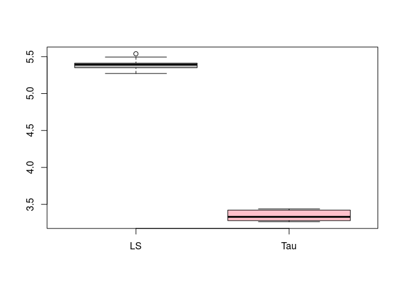

A fast algorithm for tau-estimators
================
Matias Salibian
2017-02-01

A fast algorithm for tau-estimators for linear regression
---------------------------------------------------------

This repository contains `R` (in file FastTau.R) and `MATLAB` / `OCTAVE` (in file FastTau.m) code implementing a fast algorithm to compute tau-regression estimators as proposed in [Salibian-Barrera, M., Willems, G. and Zamar, R.H. (2008)](http://dx.doi.org/10.1198/106186008X343785).

Below is an example illustrating its use in `R`. We first read the function:

``` r
source('FastTau.R')
```

We will apply it to the well-known Boston Housing data set.

``` r
data(Boston, package='MASS')
x <- model.matrix(medv ~ ., data=Boston)
y <- Boston$medv
tauest <- FastTau(x=x, y=y, N=500, kk=2, tt=5, rr=2, approximate=0, seed=456)
```

The arguments of `FastTau` are:

-   y: response vector (n x 1)
-   x: covariates matrix (n x p), possibly including a column of ones (intercept term)
-   N: number of elemental sub-set starts
-   kk: number of initial IRWLS steps to be applied to each elemental candidate
-   tt: number of best partially iterted candidates to further RWLS-iterate until convergence
-   approximate: if 0, fully compute S-scale when evaluating the objective function, otherwise use an approximation
-   rr: if `approximate = 1` above, rr is number of iterations used for the scale approximation
-   seed: seed used in the generation of the random sub-samples

This code computes a tau-estimate tuned to have 95% efficiency and 50% breakdown-point, using a rho-function that produces an estimate with small asymptotic maximum bias. The efficiency and breakdown point are controlled with the variables `c1`, `b1`, `c2` and `b2` (lines 35-38 in the file FastTau.R). See [Salibian-Barrera, M., Willems, G. and Zamar, R.H. (2008)](http://dx.doi.org/10.1198/106186008X343785). for more details.

We can compare the S- and LS-estimators:

``` r
lmest <- lm(medv ~ ., data=Boston)
round(cbind(tauest$beta, coef(lmest)), 3)
```

    ##               [,1]    [,2]
    ## (Intercept) 11.318  36.459
    ## crim        -0.146  -0.108
    ## zn           0.033   0.046
    ## indus        0.011   0.021
    ## chas         1.597   2.687
    ## nox         -5.065 -17.767
    ## rm           4.811   3.810
    ## age         -0.042   0.001
    ## dis         -0.829  -1.476
    ## rad          0.118   0.306
    ## tax         -0.008  -0.012
    ## ptratio     -0.581  -0.953
    ## black        0.013   0.009
    ## lstat       -0.267  -0.525

The estimated residual scales are

``` r
round(c(tauest$scale, summary(lmest)$sigma), 2)
```

    ## [1] 3.50 4.75

An interesting experiment is to compare the prediction properties of the robust and least squares estimator. In order to do this, we will use 10-fold CV, and, compare the squared prediction errors of each estimator. To avoid penalizing poor predictions of outlying observations, we will compute the mean squared prediction error of the 75% smallest residuals (in other words, we will use a 25% trimmed mean squared prediction error):

``` r
tms <- function(e, trim=0.25) {
  es <- sort(e^2)
  n <- length(e)
  return( mean( es[1:floor(n*(1-trim))] ) )
}
```

The following chunck of code runs 10-fold CV and computes the tau- and the LS- predictions.

``` r
n <- dim(x)[1]
k <- 10
set.seed(123)
ii <- sample( (1:n) %% k + 1)
pr.tau <- pr.ls <- rep(NA, n)
for(j in 1:k) {
  trs <- (ii != j)
  tr.x <- x[ trs, ]
  tr.y <- y[ trs ]
  taues <- FastTau(x=tr.x, y=tr.y, N=500, kk=2, tt=5, rr=2, approximate=0, seed=456)
  lses <- lm(medv ~ ., data=Boston, subset = trs)
  pr.ls[ !trs ] <- predict(lses, newdata = Boston[ !trs, ])
  pr.tau[ !trs ] <- as.vector( x[ !trs, ] %*% taues$beta )
}
```

The resulting trimmed mean squared prediction errors are

``` r
tms( (y - pr.ls) )
```

    ## [1] 5.430046

``` r
tms( (y - pr.tau) )
```

    ## [1] 3.385839

showing that the tau-estimator produces better predictions for the majority of the data. This phenomenon is observed when you repeat the above experiment using different 10-fold partitions. Below are the boxplots of the trimmed mean squared prediction errors obtained with 10 runs of the above experiment: 

The higher efficiency and comparable robustness properties of the tau-estimator over the S-estimator can be verified comparing the plot above with its counterpart for the S-estimator [here](https://github.com/msalibian/Fast-S/blob/master/README.md).
